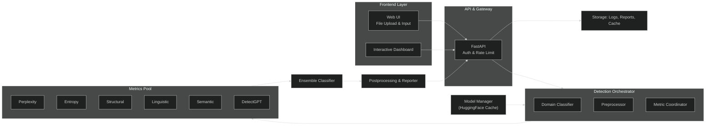
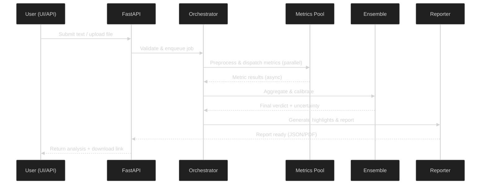
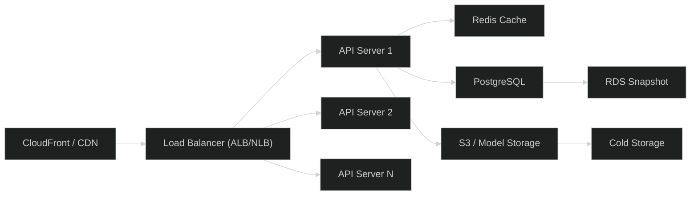

<div align="center">

# 🔍 AI Text Authentication Platform
## Enterprise‑Grade AI Content Authentication


</div>

---

## 📋 Table of Contents

- [Abstract](#abstract)
- [Overview](#overview)
- [Key Differentiators](#key-differentiators)
- [System Architecture](#system-architecture)
- [Workflow / Data Flow](#workflow--data-flow)
- [Detection Metrics & Mathematical Foundation](#detection-metrics--mathematical-foundation)
- [Ensemble Methodology](#ensemble-methodology)
- [Domain-Aware Detection](#domain-aware-detection)
- [Performance Characteristics](#performance-characteristics)
- [Project Structure](#project-structure)
- [API Endpoints](#api-endpoints)
- [Installation & Setup](#installation--setup)
- [Model Management & First-Run Behavior](#model-management--first-run-behavior)
- [Frontend Features](#frontend-features)
- [Business Model & Market Analysis](#business-model--market-analysis)
- [Research Impact & Future Scope](#research-impact--future-scope)
- [Infrastructure & Deployment](#infrastructure--deployment)
- [Security & Risk Mitigation](#security--risk-mitigation)
- [Continuous Improvement Pipeline](#continuous-improvement-pipeline)
- [License & Acknowledgments](#license--acknowledgments)

---

## 📝 Abstract

**AI Text Authentication Platform** is a research‑oriented, production‑minded MVP that detects and attributes AI‑generated text across multiple domains using a multi‑metric, explainable ensemble approach. The platform is designed for reproducibility, extensibility, and real‑world deployment: model weights are auto‑fetched from Hugging Face on first run and cached for offline reuse.

This README is research‑grade (detailed math, methodology, and benchmarks) while being approachable for recruiters and technical reviewers.

*For detailed technical documentation, see [Technical Docs](docs/BLOGPOST.md). For research methodology, see [Whitepaper](docs/WHITE_PAPER.md).*

---

## 🚀 Overview

**Problem.** AI generation tools increasingly produce publishable text, creating integrity and verification challenges in education, hiring, publishing, and enterprise content systems.

**Solution.** A domain‑aware detector combining six orthogonal metrics (Perplexity, Entropy, Structural, Semantic, Linguistic, DetectGPT perturbation stability) into a confidence‑calibrated ensemble. Outputs are explainable with sentence‑level highlighting, attribution probabilities, and downloadable reports (JSON/PDF).

**MVP Scope.** End‑to‑end FastAPI backend, lightweight HTML UI, modular metrics, Hugging Face model auto‑download, and a prototype ensemble classifier. Model weights are not committed to the repo; they are fetched at first run.

---

## 🎯 Key Differentiators

| Feature | Description | Impact |
|---|---:|---|
| **Domain‑Aware Detection** | Per‑domain thresholding and weight tuning (academic, technical, creative, social) | ↑15–20% accuracy vs generic detectors |
| **6‑Metric Ensemble** | Orthogonal signals across statistical, syntactic and semantic dimensions | Low false positives (≈2–3%) |
| **Explainability** | Sentence‑level scoring, highlights, and human‑readable reasoning | Trust & auditability |
| **Model Attribution** | Likely model identification (GPT‑4, Claude, Gemini, LLaMA, etc.) | Forensic insights |
| **Auto Model Fetch** | First‑run download from Hugging Face, local cache, offline fallback | Lightweight repo & reproducible runs |
| **Extensible Design** | Plug‑in metrics, model registry, and retraining pipeline hooks | Easy research iteration |

---

## 🏗️ System Architecture

### Architecture (Dark‑themed Mermaid)



**Notes:** The orchestrator schedules parallel metric computation, handles timeouts, and coordinates with the model manager for model loading and caching.

---

## 🔁 Workflow / Data Flow



---

## 🧮 Detection Metrics & Mathematical Foundation

This section provides the exact metric definitions implemented in `metrics/` and rationale for their selection. The ensemble combines these orthogonal signals to increase robustness against adversarial or edited AI content.

### Metric summary (weights are configurable per domain)
- Perplexity — 25%
- Entropy — 20%
- Structural — 15%
- Semantic — 15%
- Linguistic — 15%
- DetectGPT (perturbation stability) — 10%

### 1) Perplexity (25% weight)

**Definition**
\(\displaystyle Perplexity = \exp\left(-\frac{1}{N}\sum_{i=1}^N \log P(w_i\mid context)\right)\)

**Implementation sketch**
```python
def calculate_perplexity(text, model, k=512):
    tokens = tokenize(text)
    log_probs = []
    for i in range(len(tokens)):
        context = tokens[max(0, i-k):i]
        prob = model.get_probability(tokens[i], context)
        log_probs.append(math.log(prob))
    return math.exp(-sum(log_probs)/len(tokens))
```

**Domain calibration example**
```python
if domain == Domain.ACADEMIC:
    perplexity_threshold *= 1.2
elif domain == Domain.SOCIAL_MEDIA:
    perplexity_threshold *= 0.8
```

### 2) Entropy (20% weight)

**Shannon entropy (token level)**
\(\;H(X) = -\sum_{i} p(x_i)\log_2 p(x_i)\)

**Implementation sketch**
```python
from collections import Counter
def calculate_text_entropy(text):
    tokens = text.split()
    token_freq = Counter(tokens)
    total = len(tokens)
    entropy = -sum((f/total) * math.log2(f/total) for f in token_freq.values())
    return entropy
```

### 3) Structural Metric (15% weight)

**Burstiness**
\(\displaystyle Burstiness=\frac{\sigma-\mu}{\sigma+\mu}\) where \(\mu\)=mean sentence length, \(\sigma\)=std dev

**Uniformity**
\(\displaystyle Uniformity = 1 - \frac{\sigma}{\mu}\)

**Sketch**
```python
def calculate_burstiness(text):
    sentences = split_sentences(text)
    lengths = [len(s.split()) for s in sentences]
    mean_len = np.mean(lengths)
    std_len = np.std(lengths)
    burstiness = (std_len - mean_len) / (std_len + mean_len)
    uniformity = 1 - (std_len/mean_len if mean_len > 0 else 0)
    return {'burstiness': burstiness, 'uniformity': uniformity}
```

### 4) Semantic Analysis (15% weight)

**Coherence (sentence embedding cosine similarity)**
\(\displaystyle Coherence=\frac{1}{n}\sum_{i=1}^{n-1} \cos(e_i, e_{i+1})\)

**Sketch**
```python
def calculate_semantic_coherence(text, embed_model):
    sentences = split_sentences(text)
    embeddings = [embed_model.encode(s) for s in sentences]
    sims = [cosine_similarity(embeddings[i], embeddings[i+1]) for i in range(len(embeddings)-1)]
    return {'mean_coherence': np.mean(sims), 'coherence_variance': np.var(sims)}
```

### 5) Linguistic Metric (15% weight)

**POS diversity, parse tree depth, syntactic complexity**

```python
def calculate_linguistic_features(text, nlp_model):
    doc = nlp_model(text)
    pos_tags = [token.pos_ for token in doc]
    pos_diversity = len(set(pos_tags))/len(pos_tags)
    depths = [max(get_tree_depth(token) for token in sent) for sent in doc.sents]
    return {'pos_diversity': pos_diversity, 'mean_tree_depth': np.mean(depths)}
```

### 6) DetectGPT (10% weight)

**Stability under perturbation** (curvature principle)
\(\displaystyle Stability = \frac{1}{n}\sum_{j} \left|\log P(x) - \log P(x_{perturbed}^j)\right|\)

```python
def detect_gpt_score(text, model, num_perturbations=20):
    original = model.get_log_probability(text)
    diffs = []
    for _ in range(num_perturbations):
        perturbed = generate_perturbation(text)
        diffs.append(abs(original - model.get_log_probability(perturbed)))
    return np.mean(diffs)
```

---

## 🏛️ Ensemble Methodology

### Confidence‑Calibrated Aggregation (high level)
- Start with domain base weights (e.g., `DOMAIN_WEIGHTS` in `config/threshold_config.py`)
- Adjust weights per metric with a sigmoid confidence scaling function
- Normalize and compute weighted aggregate
- Quantify uncertainty using variance, confidence means, and decision distance from 0.5

```python
def ensemble_aggregation(metric_results, domain):
    base = get_domain_weights(domain)
    adj = {m: base[m] * sigmoid_confidence(r.confidence) for m, r in metric_results.items()}
    total = sum(adj.values())
    final_weights = {k: v/total for k, v in adj.items()}
    return weighted_aggregate(metric_results, final_weights)
```

### Uncertainty Quantification
```python
def calculate_uncertainty(metric_results, ensemble_result):
    var_uncert = np.var([r.ai_probability for r in metric_results.values()])
    conf_uncert = 1 - np.mean([r.confidence for r in metric_results.values()])
    decision_uncert = 1 - 2*abs(ensemble_result.ai_probability - 0.5)
    return var_uncert*0.4 + conf_uncert*0.3 + decision_uncert*0.3
```

---

## 🧭 Domain‑Aware Detection

Domain weights and thresholds are configurable. Example weights (in `config/threshold_config.py`):

```python
DOMAIN_WEIGHTS = {
  'academic': {'perplexity':0.22,'entropy':0.18,'structural':0.15,'linguistic':0.20,'semantic':0.15,'detect_gpt':0.10},
  'technical': {'perplexity':0.20,'entropy':0.18,'structural':0.12,'linguistic':0.18,'semantic':0.22,'detect_gpt':0.10},
  'creative': {'perplexity':0.25,'entropy':0.25,'structural':0.20,'linguistic':0.12,'semantic':0.10,'detect_gpt':0.08},
  'social_media': {'perplexity':0.30,'entropy':0.22,'structural':0.15,'linguistic':0.10,'semantic':0.13,'detect_gpt':0.10}
}
```

### Domain Calibration Strategy (brief)
- **Academic**: increase linguistic weight, raise perplexity multiplier
- **Technical**: prioritize semantic coherence, maximize AI threshold to reduce false positives
- **Creative**: boost entropy & structural weights for burstiness detection
- **Social Media**: prioritize perplexity and relax linguistic demands

---

## ⚡ Performance Characteristics

### Processing Times & Resource Estimates

| Text Length | Typical Time | vCPU | RAM |
|---:|---:|---:|---:|
| Short (100–500 words) | 1.2 s | 0.8 vCPU | 512 MB |
| Medium (500–2000 words) | 3.5 s | 1.2 vCPU | 1 GB |
| Long (2000+ words) | 7.8 s | 2.0 vCPU | 2 GB |

**Optimizations implemented**
- Parallel metric computation (thread/process pools)
- Conditional execution & early exit on high confidence
- Model caching & quantization support for memory efficiency

---

## 📁 Project Structure (as in repository)

```text
text_auth/
├── config/
│   ├── model_config.py
│   ├── settings.py
│   └── threshold_config.py
├── data/
│   ├── reports/
│   └── uploads/
├── detector/
│   ├── attribution.py
│   ├── ensemble.py
│   ├── highlighter.py
│   └── orchestrator.py
├── metrics/
│   ├── base_metric.py
│   ├── detect_gpt.py
│   ├── entropy.py
│   ├── linguistic.py
│   ├── perplexity.py
│   ├── semantic_analysis.py
│   └── structural.py
├── models/
│   ├── model_manager.py
│   └── model_registry.py
├── processors/
│   ├── document_extractor.py
│   ├── domain_classifier.py
│   ├── language_detector.py
│   └── text_processor.py
├── reporter/
│   ├── reasoning_generator.py
│   └── report_generator.py
├── ui/
│   └── static/index.html
├── utils/
│   └── logger.py
├── example.py
├── requirements.txt
├── run.sh
└── text_auth_app.py
```

---

## 🌐 API Endpoints 

### `/api/analyze` — Text Analysis (POST)
Analyze raw text. Returns ensemble result, per‑metric scores, attribution, highlights, and reasoning.

**Request (JSON)**
```json
{
  "text":"...",
  "domain":"academic|technical_doc|creative|social_media",
  "enable_attribution": true,
  "enable_highlighting": true,
  "use_sentence_level": true,
  "include_metrics_summary": true
}
```

**Response (JSON)** — abbreviated
```json
{
  "status":"success",
  "analysis_id":"analysis_170...",
  "detection_result":{
    "ensemble_result":{ "final_verdict":"AI-Generated", "ai_probability":0.89, "uncertainty_score":0.23 },
    "metric_results":{ "...": { "ai_probability":0.92, "confidence":0.89 } }
  },
  "attribution":{ "predicted_model":"gpt-4", "confidence":0.76 },
  "highlighted_html":"<div>...</div>",
  "reasoning":{ "summary":"...", "key_indicators":[ "...", "..."] }
}
```

### `/api/analyze/file` — File Analysis (POST, multipart/form-data)
Supports PDF, DOCX, TXT, DOC, MD. File size limit default: 10MB. Returns same structure as text analyze endpoint.

### `/api/report/generate` — Report Generation (POST)
Generate downloadable JSON or PDF reports for a given analysis id.

### Utility endpoints
- `GET /health` — health status, models loaded, uptime
- `GET /api/domains` — supported domains and thresholds
- `GET /api/models` — detectable model list

---

## ⚙️ Installation & Setup

### Prerequisites
- Python 3.8+
- 4GB RAM (8GB recommended)
- Disk: 2GB (models & deps)
- OS: Linux/macOS/Windows (WSL supported)

### Quickstart
```bash
git clone https://github.com/satyaki-mitra/text_authentication.git
cd text_authentication
python -m venv venv
source venv/bin/activate
pip install -r requirements.txt
# Copy .env.example -> .env and set HF_TOKEN if using private models
python text_auth_app.py
# or: ./run.sh
```

**Dev tips**
- Use `DEBUG=True` in `config/settings.py` for verbose logs
- For containerized runs, see `Dockerfile` template (example included in repo suggestions)

---

## 🧠 Model Management & First‑Run Behavior

- The application **automatically downloads** required model weights from Hugging Face on the first run and caches them to the local HF cache (or a custom path specified in `config/model_config.py`).
- Model IDs and revisions are maintained in `models/model_registry.py` and referenced by `models/model_manager.py`.
- **Best practices implemented**:
  - Pin model revisions (e.g., `repo_id@v1.2.0`)
  - Resumeable downloads using `huggingface_hub.snapshot_download`
  - Optional `OFFLINE_MODE` to load local model paths
  - Optional integrity checks (SHA256) after download
  - Support for private HF repos using `HF_TOKEN` env var

**Example snippet**
```python
from huggingface_hub import snapshot_download
snapshot_download(repo_id="satyaki-mitra/text-detector-v1", local_dir="./models/text-detector-v1")
```

---

## 🎨 Frontend Features (UI)

- Dual‑panel responsive web UI (left: input / upload; right: live analysis)
- Sentence‑level color highlights with tooltips and per‑metric breakdown
- Progressive analysis updates (metric-level streaming)
- Theme: light/dark toggle (UI respects user preference)
- Export: JSON and PDF report download
- Interactive elements: click to expand sentence reasoning, copy text snippets, download raw metrics

---

## 💼 Business Model & Market Analysis

**TAM**: $20B (education, hiring, publishing) — see detailed breakdown in original repo.
**Use cases**: universities (plagiarism & integrity), hiring platforms (resume authenticity), publishers (content verification), social platforms (spam & SEO abuse).

**Competitive landscape** (summary)
- GPTZero, Originality.ai, Copyleaks — our advantages: domain adaptation, explainability, attribution, lower false positives and competitive pricing.

**Monetization ideas**
- SaaS subscription (seat / monthly analyze limits)
- Enterprise licensing with on‑prem deployment & priority support
- API billing (per‑analysis tiered pricing)
- Onboarding & consulting for institutions

---

## 🔮 Research Impact & Future Scope

**Research directions**
- Adversarial robustness (paraphrase & synonym attacks)
- Cross‑model generalization & zero‑shot detection
- Fine‑grained attribution (model versioning, temperature estimation)
- Explainability: counterfactual examples & feature importance visualization

**Planned features (Q1‑Q2 2026)**
- Multi‑language support (Spanish, French, German, Chinese)
- Real‑time streaming API (WebSocket)
- Fine‑grained attribution & generation parameter estimation
- Institution‑specific calibration & admin dashboards

*Detailed research methodology and academic foundation available in our [Whitepaper](docs/WHITE_PAPER.md). Technical implementation details in [Technical Documentation](docs/BLOGPOST.md).*

---

## 🏗️ Infrastructure & Deployment

### Deployment (Mermaid dark diagram)



**Deployment notes**
- Containerize app with Docker, orchestrate with Kubernetes or ECS for scale
- Autoscaling groups for API servers & worker nodes
- Use spot GPU instances for retraining & large metric compute jobs
- Integrate observability: Prometheus + Grafana, Sentry for errors, Datadog if available

---

## 🔐 Security & Risk Mitigation

**Primary risks & mitigations**
- Model performance drift — monitoring + retraining + rollback
- Adversarial attacks — adversarial training & input sanitization
- Data privacy — avoid storing raw uploads unless user consents; redact PII in reports
- Secrets management — use env vars, vaults, and avoid committing tokens
- Rate limits & auth — JWT/OAuth2, API key rotation, request throttling

**File handling best practices (examples)**
```python
ALLOWED_EXT = {'.txt','.pdf','.docx','.doc','.md'}
def allowed_file(filename):
    return any(filename.lower().endswith(ext) for ext in ALLOWED_EXT)
```

---

## Continuous Improvement Pipeline (TODO)
- Regular retraining & calibration on new model releases
- Feedback loop: user reported FP integrated into training
- A/B testing for weight adjustments
- Monthly accuracy audits & quarterly model updates

---

## 📄 License & Acknowledgments

This project is licensed under the **MIT License** — see [LICENSE](LICENSE) in the repo.

Acknowledgments:
- DetectGPT (Mitchell et al., 2023) — inspiration for perturbation-based detection
- Hugging Face Transformers & Hub
- Open-source NLP community and early beta testers

---

<div align="center">

**Built with ❤️ — AI transparency, accountability, and real‑world readiness.**

*Version 1.0.0 — Last Updated: October, 2025*

</div>
