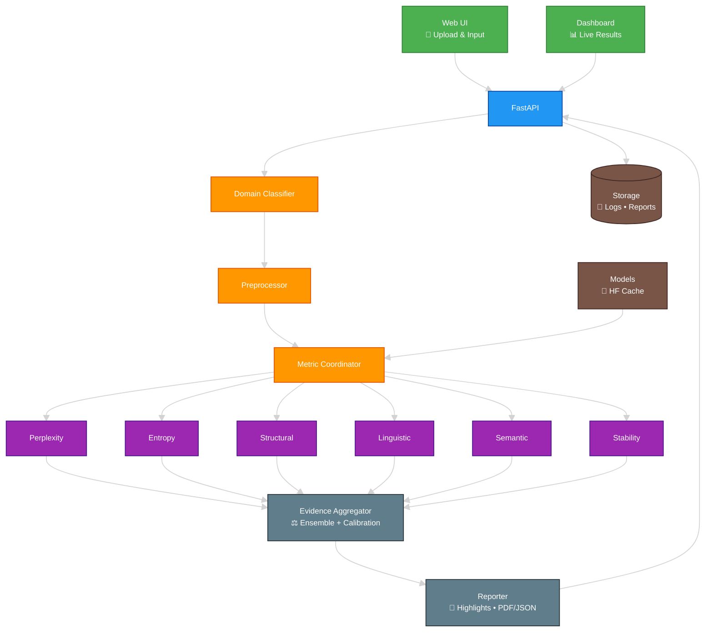
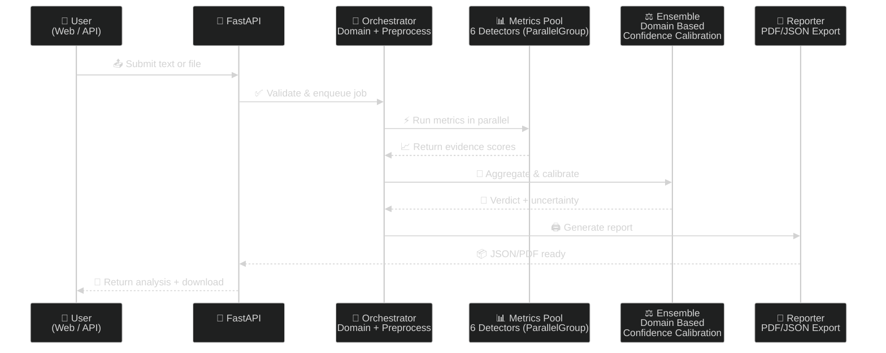
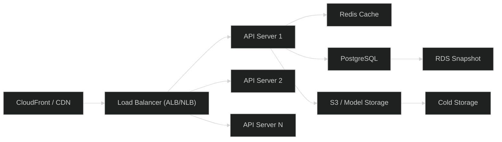

<div align="center">

# 🛡️ TEXT-AUTH: Evidence-First Text Forensics & Authenticity Assessment


</div>

---

## 📋 Table of Contents

- [Abstract](#abstract)
- [Overview](#overview)
- [Key Differentiators](#key-differentiators)
- [System Architecture](#system-architecture)
- [Workflow / Data Flow](#workflow--data-flow)
- [Forensic Signals & Mathematical Foundation](#forensic-signals--mathematical-foundation)
- [Ensemble Methodology](#ensemble-methodology)
- [Domain-Aware Analysis](#domain-aware-analysis)
- [Performance Characteristics](#performance-characteristics)
- [Project Structure](#project-structure)
- [API Endpoints](#api-endpoints)
- [Installation & Setup](#installation--setup)
- [Model Management & First-Run Behavior](#model-management--first-run-behavior)
- [Frontend Features](#frontend-features)
- [Business Model & Market Analysis](#business-model--market-analysis)
- [Research Impact & Future Scope](#research-impact--future-scope)
- [Infrastructure & Deployment](#infrastructure--deployment)
- [Security & Risk Mitigation](#security--risk-mitigation)
- [Continuous Improvement Pipeline](#continuous-improvement-pipeline)
- [License & Acknowledgments](#license--acknowledgments)

---

## 📝 Abstract

**TEXT-AUTH** is a research-oriented, production-minded **text forensics system** that evaluates written content using multiple independent linguistic, statistical, and semantic signals.

Rather than claiming authorship or identifying a generation source, the platform performs **evidence-based probabilistic assessment** of textual consistency patterns. It reports confidence-calibrated signals, uncertainty estimates, and human-interpretable explanations to support downstream decision-making.

TEXT-AUTH is designed as a **decision-support and forensic analysis tool**, not a binary classifier or attribution oracle.

- *For Architectural details, see [Architecture](docs/ARCHITECTURE.md).*
- *For detailed technical documentation, see [Technical Docs](docs/BLOGPOST.md).* 
- *For research methodology, see [Whitepaper](docs/WHITE_PAPER.md).*
- *For API documentation, see [API Documentation](docs/API_DOCUMENTATION.md).*

---

## 🚀 Overview

**Problem.** Modern text—whether human-written, assisted, edited, or fully generated—often exhibits patterns that are difficult to evaluate using binary classifiers.

**Solution.** A domain-aware analysis system combining six orthogonal evidence signals (Perplexity, Entropy, Structural, Semantic, Linguistic, Multi-perturbation stability) analysis into a confidence‑calibrated ensemble. Outputs are explainable with sentence‑level highlighting, and downloadable reports (JSON/PDF).

**Live Deployment Link:** [AI Text Authenticator Platform](https://huggingface.co/spaces/satyaki-mitra/AI_Text_Authenticator)

**MVP Scope.** End‑to‑end FastAPI backend, lightweight HTML UI, modular metrics, Hugging Face model auto‑download, and a prototype ensemble classifier. Model weights are not committed to the repo; they are fetched at first run.

---

## 🎯 Key Differentiators

| Feature | Description | Impact |
|---|---:|---|
| **Domain‑Aware Detection** | Calibrated thresholds and metric weights for 16 content types (Academic, Technical, Creative, Social Media, etc.) | Improved signal calibration and reduced false positives compared to generic binary systems |
| **6-Signal Evidence Ensemble** | Orthogonal statistical, syntactic, and semantic indicators | Robust assessments with reduced false positives |
| **Explainability** | Sentence‑level scoring, highlights, and human‑readable reasoning | Trust & auditability |
| **Auto Model Fetch** | First‑run download from Hugging Face, local cache, offline fallback | Lightweight repo & reproducible runs |
| **Extensible Design** | Plug‑in metrics, model registry, and retraining pipeline hooks | Easy research iteration |

### 📊 Supported Domains & Threshold Configuration

The platform supports domain-aware forensic analysis tailored to the following 16 domains, each with specific synthetic-text consistency thresholds and metric weights defined in `config/threshold_config.py`. These configurations are used by the ensemble classifier to adapt its decision-making process.

**Domains:**

*   `general` (Default fallback)
*   `academic`
*   `creative`
*   `ai_ml`
*   `software_dev`
*   `technical_doc`
*   `engineering`
*   `science`
*   `business`
*   `legal`
*   `medical`
*   `journalism`
*   `marketing`
*   `social_media`
*   `blog_personal`
*   `tutorial`

**Threshold Configuration Details (`config/threshold_config.py`):**

Each domain is configured with specific thresholds for the six detection metrics and an ensemble threshold. The weights determine the relative importance of each metric's output during the ensemble aggregation phase.

*   **High-Consistency Threshold:** If a metric's synthetic-consistency score exceeds this value, it contributes stronger evidence toward a synthetic-consistency assessment for that metric.
*   **Low-Consistency Threshold:** If a metric's Authentic probability falls below this value, it contributes evidence toward higher human-authored consistency for that metric.
*   **Weight:** The relative weight assigned to the metric's result during ensemble combination (normalized internally to sum to 1.0 for active metrics).

### Confidence-Calibrated Aggregation (High Level)

1.  Start with domain-specific base weights (defined in `config/threshold_config.py`).
2.  Adjust these weights dynamically based on each metric's individual confidence score using a scaling function.
3.  Normalize the adjusted weights.
4.  Compute the final weighted aggregate probability.

---

## 🏗️ System Architecture


```mermaid
%%{init: {
  "theme": "dark",
  "themeVariables": {
    "fontSize": "10px",
    "fontFamily": "Segoe UI, Helvetica, Arial, sans-serif"
  }
}}%%
flowchart TD
    classDef frontend fill:#4CAF50,stroke:#2E7D32,color:white;
    classDef api fill:#2196F3,stroke:#0D47A1,color:white;
    classDef orchestrator fill:#FF9800,stroke:#E65100,color:white;
    classDef metrics fill:#9C27B0,stroke:#4A148C,color:white;
    classDef core fill:#607D8B,stroke:#263238,color:white;
    classDef storage fill:#795548,stroke:#3E2723,color:white;

    A[Web UI<br/>📄 Upload & Input]:::frontend
    B[Dashboard<br/>📊 Live Results]:::frontend

    C[FastAPI<br/>]:::api

    D[Domain Classifier]:::orchestrator
    E[Preprocessor]:::orchestrator
    F[Metric Coordinator]:::orchestrator

    P1[Perplexity]:::metrics
    P2[Entropy]:::metrics
    P3[Structural]:::metrics
    P4[Linguistic]:::metrics
    P5[Semantic]:::metrics
    P6[Stability]:::metrics

    G[Evidence Aggregator<br/>⚖️ Ensemble + Calibration]:::core
    H[Reporter<br/>📝 Highlights • PDF/JSON]:::core
    I["Models<br/>🤗 HF Cache"]:::storage
    J[(Storage<br/>💾 Logs • Reports)]:::storage

    A --> C
    B --> C
    C --> D
    D --> E
    E --> F
    F --> P1
    F --> P2
    F --> P3
    F --> P4
    F --> P5
    F --> P6
    P1 --> G
    P2 --> G
    P3 --> G
    P4 --> G
    P5 --> G
    P6 --> G
    G --> H
    H --> C
    I --> F
    C --> J
```

**Notes:** The orchestrator schedules parallel metric computation, handles timeouts, and coordinates with the model manager for model loading and caching.

---

## 🔁 Workflow / Data Flow


```mermaid
%%{init: {
  "theme": "dark",
  "themeVariables": {
    "fontSize": "10px",
    "fontFamily": "Segoe UI, Helvetica, Arial, sans-serif"
  }
}}%%
sequenceDiagram
    participant U as 👤 User<br/>(Web / API)
    participant API as 🚪 FastAPI<br/>
    participant O as 🧠 Orchestrator<br/>Domain + Preprocess
    participant M as 📊 Metrics Pool<br/>6 Detectors (ParallelGroup)
    participant E as ⚖️ Ensemble<br/>Domain Based<br/>Confidence Calibration
    participant R as 📝 Reporter<br/>PDF/JSON Export

    U->>API: 📤 Submit text or file
    API->>O: ✅ Validate & enqueue job
    O->>M: ⚡ Run metrics in parallel
    M-->>O: 📈 Return evidence scores
    O->>E: 🔗 Aggregate & calibrate
    E-->>O: 🎯 Verdict + uncertainty
    O->>R: 🖨️ Generate report
    R-->>API: 📦 JSON/PDF ready
    API-->>U: 🔗 Return analysis + download
```

---

## 🧮 Forensic Signals & Mathematical Foundation

This section provides the exact metric definitions implemented in `metrics/` and rationale for their selection. The ensemble combines these orthogonal signals to increase robustness against edited, paraphrased, or algorithmically regularized text.

### Metric summary (weights are configurable per domain)
- Perplexity — 25%
- Entropy — 20%
- Structural — 15%
- Semantic — 15%
- Linguistic — 15%
- Multi-perturbation Stability — 10%

### 1) Perplexity (25% weight)

**Definition**
```math
Perplexity = \exp\left(-\frac{1}{N}\sum_{i=1}^N \log P(w_i\mid context)\right)
```

**Implementation sketch**
```python
def calculate_perplexity(text, model, k=512):
    tokens = tokenize(text)
    log_probs = []
    for i in range(len(tokens)):
        context = tokens[max(0, i-k):i]
        prob = model.get_probability(tokens[i], context)
        log_probs.append(math.log(prob))
    return math.exp(-sum(log_probs)/len(tokens))
```

**Domain calibration example**
```python
if domain == Domain.ACADEMIC:
    perplexity_threshold *= 1.2
elif domain == Domain.SOCIAL_MEDIA:
    perplexity_threshold *= 0.8
```

### 2) Entropy (20% weight)

**Shannon entropy (token level)**
```math
H(X) = -Σ p(x_i) * log₂ p(x_i)
```

**Implementation sketch**
```python
from collections import Counter
def calculate_text_entropy(text):
    tokens = text.split()
    token_freq = Counter(tokens)
    total = len(tokens)
    entropy = -sum((f/total) * math.log2(f/total) for f in token_freq.values())
    return entropy
```

### 3) Structural Metric (15% weight)

**Burstiness**
```math
Burstiness = \frac{\sigma - \mu}{\sigma + \mu}
```

where:
- μ = mean sentence length
- σ = standard deviation of sentence length

**Uniformity**
```math
Uniformity = 1 - \frac{\sigma}{\mu}
```

where:
- μ = mean sentence length
- σ = standard deviation of sentence length


**Sketch**
```python
def calculate_burstiness(text):
    sentences = split_sentences(text)
    lengths = [len(s.split()) for s in sentences]
    mean_len = np.mean(lengths)
    std_len = np.std(lengths)
    burstiness = (std_len - mean_len) / (std_len + mean_len)
    uniformity = 1 - (std_len/mean_len if mean_len > 0 else 0)
    return {'burstiness': burstiness, 'uniformity': uniformity}
```

### 4) Semantic Analysis (15% weight)

**Coherence (sentence embedding cosine similarity)**
```math
Coherence = \frac{1}{n} \sum_{i=1}^{n-1} \cos(e_i, e_{i+1})
```

**Sketch**
```python
def calculate_semantic_coherence(text, embed_model):
    sentences = split_sentences(text)
    embeddings = [embed_model.encode(s) for s in sentences]
    sims = [cosine_similarity(embeddings[i], embeddings[i+1]) for i in range(len(embeddings)-1)]
    return {'mean_coherence': np.mean(sims), 'coherence_variance': np.var(sims)}
```

### 5) Linguistic Metric (15% weight)

**POS diversity, parse tree depth, syntactic complexity**

```python
def calculate_linguistic_features(text, nlp_model):
    doc = nlp_model(text)
    pos_tags = [token.pos_ for token in doc]
    pos_diversity = len(set(pos_tags))/len(pos_tags)
    depths = [max(get_tree_depth(token) for token in sent) for sent in doc.sents]
    return {'pos_diversity': pos_diversity, 'mean_tree_depth': np.mean(depths)}
```

### 6) MultiPerturbationStability (10% weight)

**Stability under perturbation** (curvature principle)
```math
Stability = \frac{1}{n} \sum_{j} \left| \log P(x) - \log P(x_{perturbed_j}) \right|
```

```python
def multi_perturbation_stability_score(text, model, num_perturbations=20):
    original = model.get_log_probability(text)
    diffs = []
    for _ in range(num_perturbations):
        perturbed = generate_perturbation(text)
        diffs.append(abs(original - model.get_log_probability(perturbed)))
    return np.mean(diffs)
```

---

## 🏛️ Ensemble Methodology

### Confidence‑Calibrated Aggregation (high level)
- Start with domain base weights (e.g., `DOMAIN_WEIGHTS` in `config/threshold_config.py`)
- Adjust weights per metric with a sigmoid confidence scaling function
- Normalize and compute weighted aggregate
- Quantify uncertainty using variance, confidence means, and decision distance from 0.5

```python
def ensemble_aggregation(metric_results, domain):
    base = get_domain_weights(domain)
    adj = {m: base[m] * sigmoid_confidence(r.confidence) for m, r in metric_results.items()}
    total = sum(adj.values())
    final_weights = {k: v/total for k, v in adj.items()}
    return weighted_aggregate(metric_results, final_weights)
```

### Uncertainty Quantification
```python
def calculate_uncertainty(metric_results, ensemble_result):
    var_uncert = np.var([r.synthetic_probability for r in metric_results.values()])
    conf_uncert = 1 - np.mean([r.confidence for r in metric_results.values()])
    decision_uncert = 1 - 2*abs(ensemble_result.synthetic_probability - 0.5)
    return var_uncert*0.4 + conf_uncert*0.3 + decision_uncert*0.3
```

---

## 🧭 Domain‑Aware Detection

Domain weights and thresholds are configurable. Example weights (in `config/threshold_config.py`):

```python
DOMAIN_WEIGHTS = {'academic'     : {'perplexity':0.22,'entropy':0.18,'structural':0.15,'linguistic':0.20,'semantic':0.15,'multi_perturbation_stability':0.10},
                  'technical'    : {'perplexity':0.20,'entropy':0.18,'structural':0.12,'linguistic':0.18,'semantic':0.22,'multi_perturbation_stability':0.10},
                  'creative'     : {'perplexity':0.25,'entropy':0.25,'structural':0.20,'linguistic':0.12,'semantic':0.10,'multi_perturbation_stability':0.08},
                  'social_media' : {'perplexity':0.30,'entropy':0.22,'structural':0.15,'linguistic':0.10,'semantic':0.13,'multi_perturbation_stability':0.10},
                 }
```

### Domain Calibration Strategy (brief)
- **Academic**: increase linguistic weight, raise perplexity multiplier
- **Technical**: prioritize semantic coherence, maximize Synthetic threshold to reduce false positives
- **Creative**: boost entropy & structural weights for burstiness detection
- **Social Media**: prioritize perplexity and relax linguistic demands

---

## ⚡ Performance Characteristics

### Processing Times & Resource Estimates

| Text Length | Typical Time | vCPU | RAM |
|---:|---:|---:|---:|
| Short (100–500 words) | 1.2 s | 0.8 vCPU | 512 MB |
| Medium (500–2000 words) | 3.5 s | 1.2 vCPU | 1 GB |
| Long (2000+ words) | 7.8 s | 2.0 vCPU | 2 GB |

**Optimizations implemented**
- Parallel metric computation (thread/process pools)
- Conditional execution & early exit on high confidence
- Model caching & quantization support for memory efficiency

---

## 📁 Project Structure (as in repository)

```text
text_auth/
├── config/
│   ├── model_config.py
│   ├── settings.py
|   ├── enums.py
|   ├── constants.py
|   ├── schemas.py
│   └── threshold_config.py
├── data/
│   ├── reports/
|   ├── validation_data/
│   └── uploads/
├── services/
│   ├── reasoning_generator.py
│   ├── ensemble_classifier.py
│   ├── highlighter.py
│   └── orchestrator.py
├── metrics/
│   ├── base_metric.py
│   ├── multi_perturbation_stability.py
│   ├── entropy.py
│   ├── linguistic.py
│   ├── perplexity.py
│   ├── semantic_analysis.py
│   └── structural.py
├── models/
│   ├── model_manager.py
│   └── model_registry.py
├── processors/
│   ├── document_extractor.py
│   ├── domain_classifier.py
│   ├── language_detector.py
│   └── text_processor.py
├── reporter/
│   └── report_generator.py
├── ui/
│   └── static/index.html
├── utils/
│   └── logger.py
├── validation/
├── requirements.txt
├── README.md
├── Dockerfile
├── .gitignore
├── test_integration.py
├── .env.example
├── requirements.txt
└── text_auth_app.py
```

---

## 🌐 API Endpoints 

### `/api/analyze` — Text Analysis (POST)
Analyze raw text. Returns ensemble assessment, per‑metric signals, highlights, and explainability reasoning.

**Request (JSON)**
```json
{
  "text":"...",
  "domain":"academic|technical_doc|creative|social_media",
  "enable_highlighting": true,
  "use_sentence_level": true,
```

**Response (JSON)** — abbreviated
```json
{
  "status": "success",
  "analysis_id": "analysis_170...",
  "assessment": {
    "final_verdict": "Synthetic / Authentic / Hybrid",
    "overall_confidence": 0.89,
    "uncertainty_score": 0.23
  },
  "metric_signals": {
    "perplexity": { "score": 0.92, "confidence": 0.89 }
  },
  "highlighted_html": "<div>...</div>",
  "reasoning": {
    "summary": "...",
    "key_indicators": ["...", "..."]
  }
}
```

> **Note:** The final verdict represents a probabilistic consistency assessment, not an authorship or generation claim.


### `/api/analyze/file` — File Analysis (POST, multipart/form-data)
Supports PDF, DOCX, TXT, DOC, MD. File size limit default: 10MB. Returns same structure as text analyze endpoint.

### `/api/report/generate` — Report Generation (POST)
Generate downloadable JSON or PDF reports for a given analysis id.

### Utility endpoints
- `GET /health` — health status, models loaded, uptime
- `GET /api/domains` — supported domains and thresholds
- `GET /api/models` — detectable model list

---

## ⚙️ Installation & Setup

### Prerequisites
- Python 3.8+
- 4GB RAM (8GB recommended)
- Disk: 2GB (models & deps)
- OS: Linux/macOS/Windows (WSL supported)

### Quickstart
```bash
git clone https://github.com/satyaki-mitra/text_authentication.git
cd text_authentication
python -m venv venv
source venv/bin/activate
pip install -r requirements.txt
# Copy .env.example -> .env and set HF_TOKEN if using private models
python text_auth_app.py
# or: ./run.sh
```

**Dev tips**
- Use `DEBUG=True` in `config/settings.py` for verbose logs
- For containerized runs, see `Dockerfile` template (example included in repo suggestions)

---

## 🧠 Model Management & First‑Run Behavior

- The application **automatically downloads** required model weights from Hugging Face on the first run and caches them to the local HF cache (or a custom path specified in `config/model_config.py`).
- Model IDs and revisions are maintained in `models/model_registry.py` and referenced by `models/model_manager.py`.
- **Best practices implemented**:
  - Pin model revisions (e.g., `repo_id@v1.2.0`)
  - Resumeable downloads using `huggingface_hub.snapshot_download`
  - Optional `OFFLINE_MODE` to load local model paths
  - Optional integrity checks (SHA256) after download
  - Support for private HF repos using `HF_TOKEN` env var

**Example snippet**
```python
from huggingface_hub import snapshot_download
snapshot_download(repo_id="satyaki-mitra/statistical-text-reference-v1", local_dir="./models/text-detector-v1")
```

---

## 🎨 Frontend Features (UI)

- Dual‑panel responsive web UI (left: input / upload; right: live analysis)
- Sentence‑level color highlights with tooltips and per‑metric breakdown
- Progressive analysis updates (metric-level streaming)
- Theme: light/dark toggle (UI respects user preference)
- Export: JSON and PDF report download
- Interactive elements: click to expand sentence reasoning, copy text snippets, download raw metrics

---

## 💼 Business Model & Market Analysis

**TAM**: $20B (education, hiring, publishing) — see detailed breakdown in original repo.
**Use cases**: universities (plagiarism & integrity), hiring platforms (resume authenticity), publishers (content verification), social platforms (spam & SEO abuse).

**Competitive landscape** (summary)
- Binary authorship-claim systems (e.g., GPTZero-style tools) — our advantages: domain adaptation, explainability, evidence transparency, lower false positives and competitive pricing. TEXT-AUTH explicitly avoids authorship claims in favor of evidence-based forensic assessment.

**Monetization ideas**
- SaaS subscription (seat / monthly analyze limits)
- Enterprise licensing with on‑prem deployment & priority support
- API billing (per‑analysis tiered pricing)
- Onboarding & consulting for institutions

---

## 🔮 Research Impact & Future Scope

**Research directions**
- Adversarial robustness (paraphrase & synonym attacks)
- Cross‑model generalization & zero‑shot detection
- Explainability: counterfactual examples & feature importance visualization

**Planned features (Q1‑Q2 2026)**
- Multi‑language support (Spanish, French, German, Chinese)
- Real‑time streaming API (WebSocket)
- Institution‑specific calibration & admin dashboards

*Detailed research methodology and academic foundation available in our [Whitepaper](docs/WHITE_PAPER.md). Technical implementation details in [Technical Documentation](docs/BLOGPOST.md).*

---

## 🏗️ Infrastructure & Deployment

### Deployment (Mermaid dark diagram)


```mermaid
%%{init: {'theme': 'dark'}}%%
flowchart LR
    CDN[CloudFront / CDN] --> LB["Load Balancer (ALB/NLB)"]
    LB --> API1[API Server 1]
    LB --> API2[API Server 2]
    LB --> APIN[API Server N]
    API1 --> Cache[Redis Cache]
    API1 --> DB[PostgreSQL]
    API1 --> S3["S3 / Model Storage"]
    DB --> Backup["RDS Snapshot"]
    S3 --> Archive["Cold Storage"]
```

**Deployment notes**
- Containerize app with Docker, orchestrate with Kubernetes or ECS for scale
- Autoscaling groups for API servers & worker nodes
- Use spot GPU instances for retraining & large metric compute jobs
- Integrate observability: Prometheus + Grafana, Sentry for errors, Datadog if available

---

## 🔐 Security & Risk Mitigation

**Primary risks & mitigations**
- Model performance drift — monitoring + retraining + rollback
- Adversarial attacks — adversarial training & input sanitization
- Data privacy — avoid storing raw uploads unless user consents; redact PII in reports
- Secrets management — use env vars, vaults, and avoid committing tokens
- Rate limits & auth — JWT/OAuth2, API key rotation, request throttling

**File handling best practices (examples)**
```python
ALLOWED_EXT = {'.txt','.pdf','.docx','.doc','.md'}
def allowed_file(filename):
    return any(filename.lower().endswith(ext) for ext in ALLOWED_EXT)
```

---

## Continuous Improvement Pipeline (TODO)
- Regular retraining & calibration on new model releases
- Feedback loop: user reported FP integrated into training
- A/B testing for weight adjustments
- Monthly accuracy audits & quarterly model updates

---

## 📄 License & Acknowledgments

This project is licensed under the **MIT License** — see [LICENSE](LICENSE) in the repo.

Acknowledgments:
- DetectGPT (Mitchell et al., 2023) — inspiration for perturbation-based detection
- Hugging Face Transformers & Hub
- Open-source NLP community and early beta testers

---

<div align="center">

**Built with ❤️ — Evidence-based text forensics, transparency, and real-world readiness.**

*Version 1.0.0 — Last Updated: October, 2025*

</div>
