# TEXT-AUTH: System Architecture Documentation

> TEXT-AUTH is an evidence-first, domain-aware AI text detection system
> designed around independent signals, calibrated aggregation, and
> explainability rather than black-box classification.

---

## Table of Contents
1. [System Overview](#system-overview)
2. [High-Level Architecture](#high-level-architecture)
3. [Layer-by-Layer Architecture](#layer-by-layer-architecture)
4. [Data Flow](#data-flow)
5. [Technology Stack](#technology-stack)

---

## System Overview

**TEXT-AUTH** is a sophisticated AI text detection system that employs multiple machine learning metrics and ensemble methods to determine whether text is synthetically generated, authentically written, or hybrid content.

### Key Capabilities
- **Multi-Metric Analysis**: 6 independent detection metrics (Structural, Perplexity, Entropy, Semantic, Linguistic, Multi-Perturbation Stability)
- **Domain-Aware Calibration**: Adaptive thresholds for 16 text domains (Academic, Creative, Technical, etc.)
- **Ensemble Aggregation**: Confidence-weighted combination with uncertainty quantification
- **Sentence-Level Highlighting**: Visual feedback with probability scores
- **Comprehensive Reporting**: JSON and PDF reports with detailed analysis

### Design Principles
- **Modular Architecture**: Clean separation of concerns across layers
- **Fail-Safe Design**: Graceful degradation with fallback strategies
- **Parallel Processing**: Multi-threaded metric execution for performance
- **Domain Expertise**: Specialized thresholds calibrated per content type

## Why Multi-Metric Instead of a Single Classifier?

- Single classifiers overfit stylistic artifacts
- LLMs rapidly adapt to detectors
- Independent statistical signals decay slower
- Ensemble disagreement is itself evidence

---

## High-Level Architecture

```mermaid
graph TB
    subgraph "Presentation Layer"
        UI[Web Interface/API]
    end

    subgraph "Application Layer"
        ORCH[Detection Orchestrator]
        ORCH --> |coordinates| PIPE[Processing Pipeline]
    end

    subgraph "Service Layer"
        ENSEMBLE[Ensemble Classifier]
        HIGHLIGHT[Text Highlighter]
        REASON[Reasoning Generator]
        REPORT[Report Generator]
    end

    subgraph "Processing Layer"
        EXTRACT[Document Extractor]
        TEXTPROC[Text Processor]
        DOMAIN[Domain Classifier]
        LANG[Language Detector]
    end

    subgraph "Metrics Layer"
        STRUCT[Structural Metric]
        PERP[Perplexity Metric]
        ENT[Entropy Metric]
        SEM[Semantic Metric]
        LING[Linguistic Metric]
        MPS[Multi-Perturbation Stability]
    end

    subgraph "Model Layer"
        MANAGER[Model Manager]
        REGISTRY[Model Registry]
        CACHE[(Model Cache)]
    end

    subgraph "Configuration Layer"
        CONFIG[Settings]
        ENUMS[Enums]
        SCHEMAS[Data Schemas]
        CONSTANTS[Constants]
        THRESHOLDS[Domain Thresholds]
    end

    UI --> ORCH
    
    ORCH --> EXTRACT
    ORCH --> TEXTPROC
    ORCH --> DOMAIN
    ORCH --> LANG
    
    ORCH --> STRUCT
    ORCH --> PERP
    ORCH --> ENT
    ORCH --> SEM
    ORCH --> LING
    ORCH --> MPS
    
    ORCH --> ENSEMBLE
    ENSEMBLE --> HIGHLIGHT
    ENSEMBLE --> REASON
    ENSEMBLE --> REPORT
    
    STRUCT --> MANAGER
    PERP --> MANAGER
    ENT --> MANAGER
    SEM --> MANAGER
    LING --> MANAGER
    MPS --> MANAGER
    DOMAIN --> MANAGER
    LANG --> MANAGER
    
    MANAGER --> REGISTRY
    MANAGER --> CACHE
    
    ORCH --> CONFIG
    ENSEMBLE --> THRESHOLDS

    style UI fill:#e1f5ff
    style ORCH fill:#fff3e0
    style ENSEMBLE fill:#f3e5f5
    style MANAGER fill:#e8f5e9
    style CONFIG fill:#fce4ec
```

---

## Layer-by-Layer Architecture

### 1. Configuration Layer (`config/`)

The foundation layer providing enums, schemas, constants, and domain-specific thresholds.

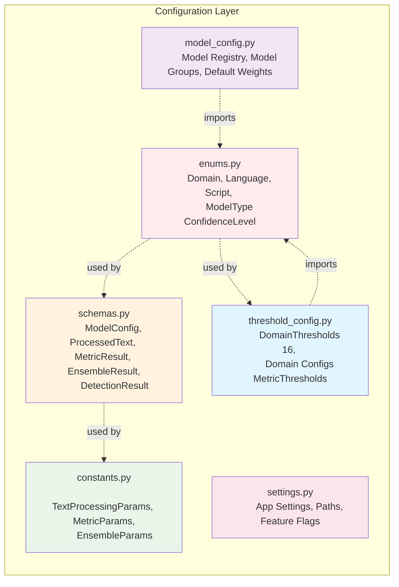

**Key Components:**
- **enums.py**: Core enumerations (Domain, Language, Script, ModelType, ConfidenceLevel)
- **schemas.py**: Data classes for structured data exchange
- **constants.py**: Frozen dataclasses with hyperparameters for each metric
- **threshold_config.py**: Domain-specific thresholds for 16 domains
- **model_config.py**: Model registry with download priorities and configurations
- **settings.py**: Application settings with Pydantic validation

---

### 2. Model Abstraction Layer (`models/`)

Conceptual model abstraction layer used by metrics for centralized loading and reuse - loading, caching, and providing unified access.

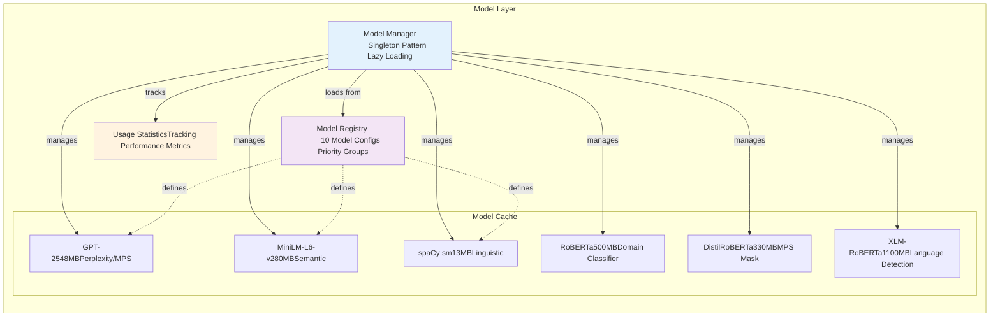

**Key Features:**
- **Lazy Loading**: Models loaded on-demand
- **Caching Strategy**: LRU cache with max 5 models
- **Usage Tracking**: Statistics for optimization
- **Priority Groups**: Essential, Extended, Optional
- **Total Size**: ~2.8GB for all models

---

### 3. Processing Layer (`processors/`)

Handles document extraction, text preprocessing, domain identification, and language detection.

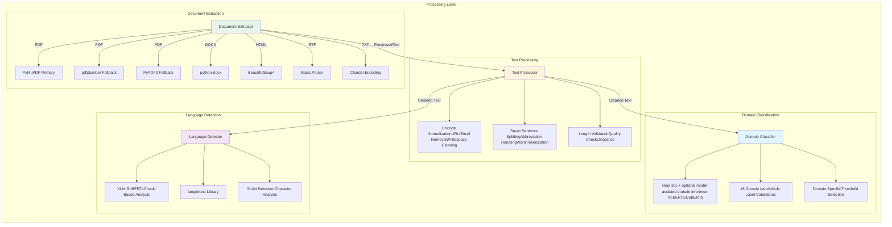

**Processing Pipeline:**
1. **Document Extraction**: Multi-format support with fallback strategies
2. **Text Cleaning**: Unicode normalization, noise removal, validation
3. **Domain Identification**: Zero-shot classification with confidence scores
4. **Language Detection**: Multi-strategy approach with script analysis

---

### 4. Metrics Layer (`metrics/`)

Six independent detection metrics analyzing different text characteristics.

```mermaid
graph TB
    subgraph "Metrics Layer"
        direction TB
        
        BASE[Base MetricAbstract ClassCommon Interface]
        
        subgraph "Statistical Metrics"
            STRUCT[Structural MetricNo ML ModelStatistical Features]
            STRUCT --> SF1[Sentence Length DistributionBurstiness ScoreReadability]
            STRUCT --> SF2[N-gram DiversityType-Token RatioRepetition Patterns]
        end
        
        subgraph "ML-Based Metrics"
            PERP[Perplexity MetricGPT-2 ModelText Predictability]
            PERP --> PF1[Overall PerplexitySentence-Level PerplexityCross-Entropy]
            PERP --> PF2[Chunk AnalysisVariance ScoringNormalization]
            
            ENT[Entropy MetricGPT-2 TokenizerRandomness Analysis]
            ENT --> EF1[Character EntropyWord EntropyToken Entropy]
            ENT --> EF2[Token DiversitySequence UnpredictabilityPattern Detection]
            
            SEM[Semantic MetricMiniLM EmbeddingsCoherence Analysis]
            SEM --> SF3[Sentence SimilarityTopic ConsistencyCoherence Score]
            SEM --> SF4[Repetition DetectionTopic DriftContextual Consistency]
            
            LING[Linguistic MetricspaCy NLPGrammar Analysis]
            LING --> LF1[POS DiversityPOS EntropySyntactic Complexity]
            LING --> LF2[Grammatical PatternsWriting StylePattern Detection]
            
            MPS[Multi-PerturbationGPT-2 + DistilRoBERTaStability Analysis]
            MPS --> MF1[Text PerturbationLikelihood CalculationStability Score]
            MPS --> MF2[Curvature AnalysisChunk StabilityVariance Scoring]
        end
    end
    
    BASE -.->|inherited by| STRUCT
    BASE -.->|inherited by| PERP
    BASE -.->|inherited by| ENT
    BASE -.->|inherited by| SEM
    BASE -.->|inherited by| LING
    BASE -.->|inherited by| MPS
    
    style BASE fill:#ffebee
    style STRUCT fill:#e8f5e9
    style PERP fill:#fff3e0
    style ENT fill:#e1f5ff
    style SEM fill:#f3e5f5
    style LING fill:#fce4ec
    style MPS fill:#fff9c4
```

**Metric Characteristics:**

| Metric | Model Required | Complexity | Typical Influence Range (Indicative) |
|--------|---------------|------------|--------------|
| Structural | ❌ | Low | 15-20% |
| Perplexity | GPT-2 | Medium | 20-27% |
| Entropy | GPT-2 Tokenizer | Medium | 13-17% |
| Semantic | MiniLM | Medium | 18-20% |
| Linguistic | spaCy | Medium | 12-16% |
| MPS | GPT-2 + DistilRoBERTa | High | 8-10% |

> *Actual weights are dynamically calibrated per domain and configuration.*

---

### 5. Service Layer (`services/`)

Coordinates ensemble aggregation, highlighting, reasoning generation, and orchestration.

```mermaid
graph TB
    subgraph "Service Layer"
        direction TB
        
        subgraph "Orchestrator"
            ORCH[Detection OrchestratorPipeline Coordinator]
            ORCH --> PIPE[Processing Pipeline6-Step Execution]
            PIPE --> STEP1[1. Text Preprocessing]
            PIPE --> STEP2[2. Language Detection]
            PIPE --> STEP3[3. Domain Classification]
            PIPE --> STEP4[4. Metric ExecutionParallel/Sequential]
            PIPE --> STEP5[5. Ensemble Aggregation]
            PIPE --> STEP6[6. Result Compilation]
        end
        
        subgraph "Ensemble Classifier"
            ENSEMBLE[Ensemble ClassifierMulti-Strategy Aggregation]
            ENSEMBLE --> METHOD1[Confidence CalibratedSigmoid Weighting]
            ENSEMBLE --> METHOD2[Consensus BasedAgreement Rewards]
            ENSEMBLE --> METHOD3[Domain WeightedStatic Weights]
            ENSEMBLE --> METHOD4[Simple AverageFallback]
            ENSEMBLE --> CALC[Uncertainty QuantificationConsensus AnalysisConfidence Scoring]
        end
        
        subgraph "Highlighter"
            HIGHLIGHT[Text HighlighterSentence-Level Analysis]
            HIGHLIGHT --> COLORS[4-Color SystemAuthentic/UncertainHybrid/Synthetic]
            HIGHLIGHT --> SENTENCE[Sentence EnsembleDomain AdjustmentsTooltip Generation]
        end
        
        subgraph "Reasoning"
            REASON[Reasoning GeneratorExplainable AI]
            REASON --> SUMMARY[Executive SummaryVerdict Explanation]
            REASON --> INDICATORS[Key IndicatorsMetric Breakdown]
            REASON --> EVIDENCE[Supporting EvidenceContradicting Evidence]
            REASON --> RECOM[RecommendationsUncertainty Analysis]
        end
    end
    
    ORCH -->|coordinates| ENSEMBLE
    ORCH -->|uses| HIGHLIGHT
    ORCH -->|uses| REASON
    ENSEMBLE -->|provides| HIGHLIGHT
    ENSEMBLE -->|provides| REASON
    
    style ORCH fill:#fff3e0
    style ENSEMBLE fill:#e3f2fd
    style HIGHLIGHT fill:#f3e5f5
    style REASON fill:#e8f5e9
```

**Service Features:**
- **Parallel Execution**: ThreadPoolExecutor for metric computation
- **Ensemble Methods**: 4 aggregation strategies with fallbacks
- **Sentence Highlighting**: 4-category color system (Authentic/Uncertain/Hybrid/Synthetic)
- **Explainable AI**: Detailed reasoning with metric contributions

---

### 6. Reporter Layer (`reporter/`)

Generates comprehensive reports in multiple formats.

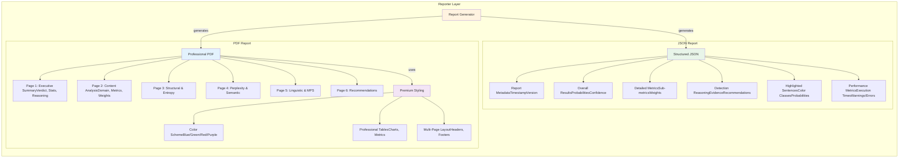

**Report Formats:**
- **JSON**: Machine-readable with complete data
- **PDF**: Human-readable with professional formatting
- **Charts**: Pie charts for probability distribution
- **Tables**: Metric contributions, detailed sub-metrics
- **Styling**: Color-coded, multi-page layout with branding

---

## Data Flow

### Complete Detection Pipeline

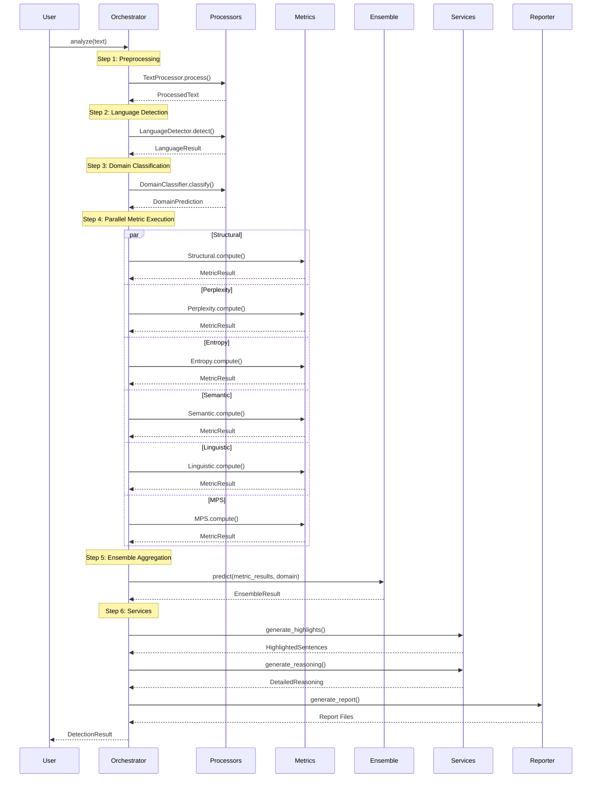

### Ensemble Aggregation Flow

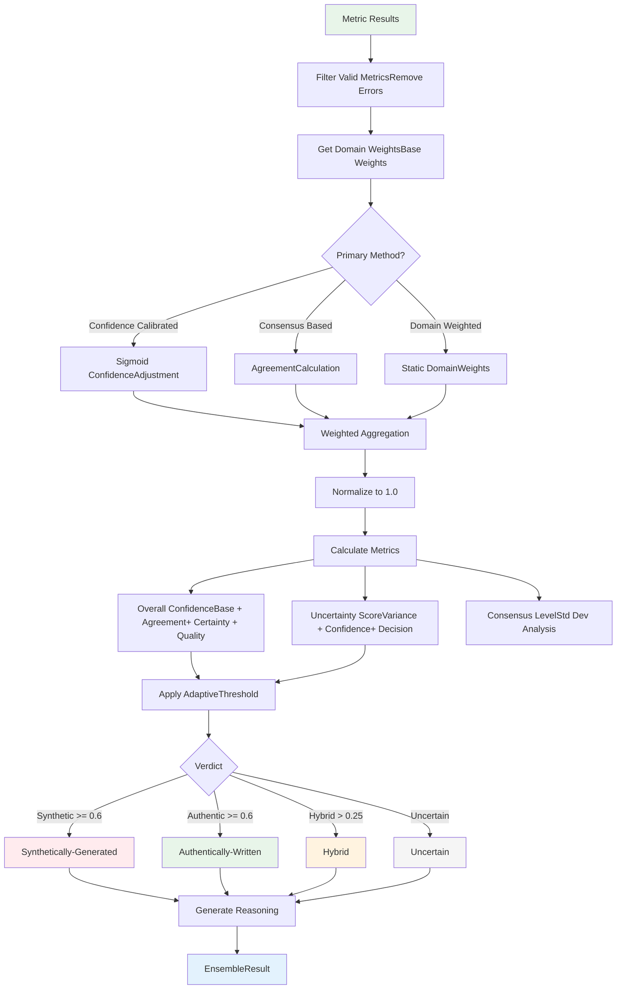

---

## Technology Stack

### Core Technologies

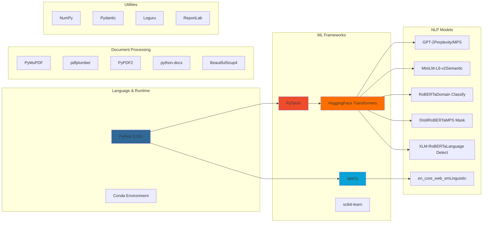

### Dependencies Summary

| Category | Libraries | Purpose |
|----------|-----------|---------|
| **ML Core** | PyTorch, Transformers, spaCy | Model execution, NLP |
| **Document** | PyMuPDF, pdfplumber, python-docx | Multi-format extraction |
| **Analysis** | NumPy, scikit-learn | Numerical computation |
| **Validation** | Pydantic | Data validation |
| **Logging** | Loguru | Structured logging |
| **Reporting** | ReportLab | PDF generation |

---

## Deployment Architecture

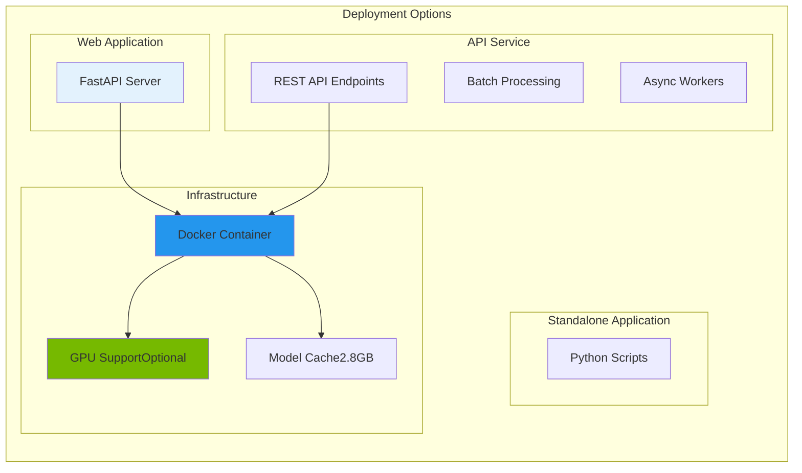

### System Requirements

- **Python**: 3.10+
- **RAM**: 8GB minimum, 16GB recommended
- **Storage**: 5GB (models + data)
- **GPU**: Optional (CUDA/MPS for faster inference)
- **CPU**: 4+ cores for parallel execution

---

## Performance Characteristics

### Execution Modes

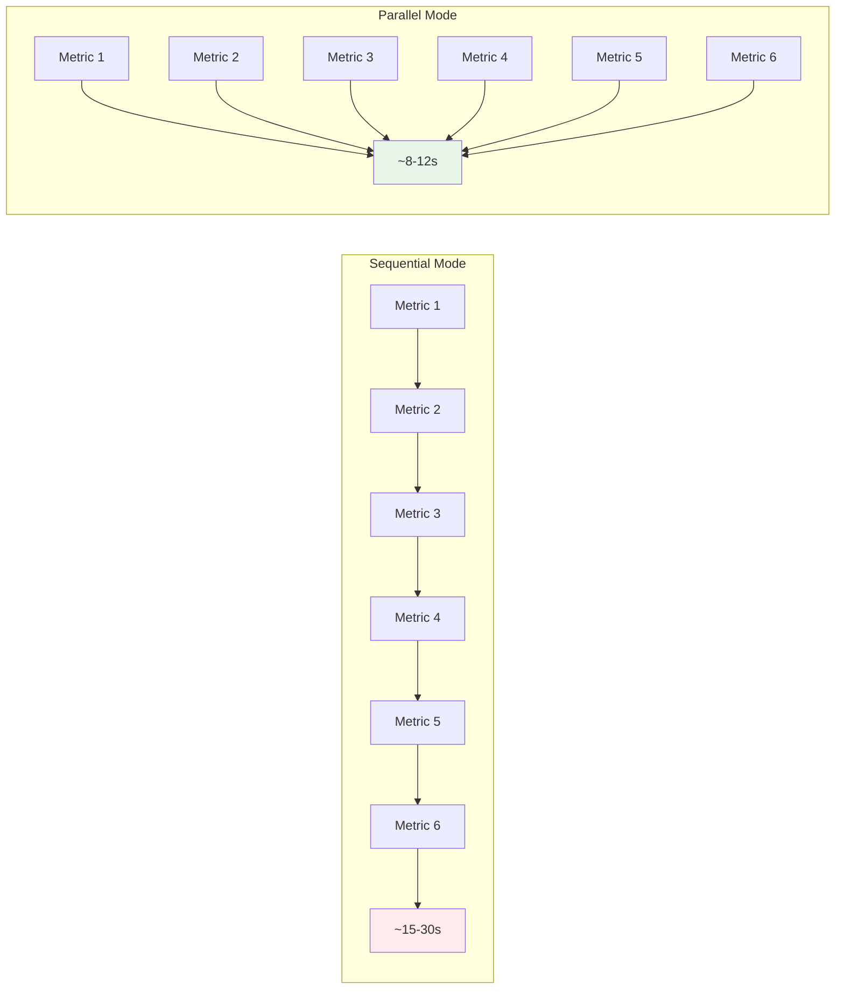

### Metric Execution Times

| Metric | Avg Time | Complexity | Model Size |
|--------|----------|------------|------------|
| Structural | 0.5-1s | Low | 0MB |
| Perplexity | 2-4s | Medium | 548MB |
| Entropy | 1-2s | Medium |  ~50MB (shared) |
| Semantic | 3-5s | Medium | 80MB |
| Linguistic | 2-3s | Medium | 13MB |
| MPS | 5-10s | High | 878MB (GPT-2 + DistilRoBERTa) |

**Total Sequential**: ~15-25 seconds  
**Total Parallel**: ~8-12 seconds (limited by slowest metric)

---

## Security & Privacy

### Data Handling

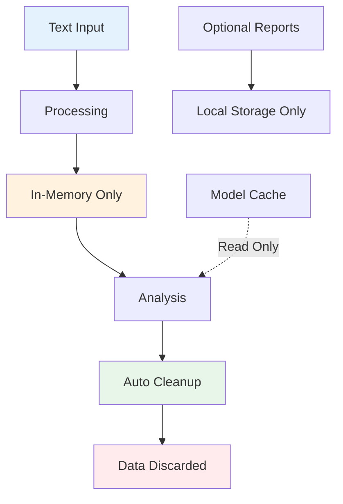

### Security Features
- ✅ **No External Data Transmission**: All processing local
- ✅ **No Data Persistence**: Text data not stored by default
- ✅ **Model Integrity**: Checksums for downloaded models
- ✅ **Input Validation**: Pydantic schemas for all inputs
- ✅ **Error Isolation**: Graceful degradation, no information leakage

---

> This system does not claim ground truth authorship. It estimates probabilistic authenticity signals based on measurable text properties.